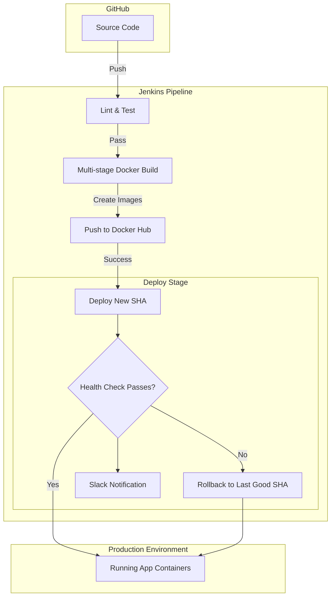

# PulseCheck

**PulseCheck** — [Live App (Demo)](#) · [GitHub](https://github.com/Sairaj-creator/PulseCheck)

PulseCheck is a containerized service-health dashboard. While the application provides a simple and effective way to monitor uptime and response times of various targets, the core engineering focus of this project is its **resilient, automated CI/CD pipeline**.

## Architecture & Pipeline Flow

The infrastructure is built around a self-hosted Jenkins pipeline that safely builds, tests, and deploys the application with automated rollback capabilities.

## CI/CD Pipeline Evidence

Since the pipeline itself is the core of this project, here is the evidence of it working in production.

### 1. End-to-End Pipeline Run
*(Add your screenshot here showing Lint ✅ Test ✅ Build ✅ Push ✅ Deploy ✅)*

### 2. Automated Rollback in Action
The pipeline explicitly guards against broken deployments. When a bad commit fails the `/health` check after deployment, the system detects it, rolls back the containers to the previous good SHA, and alerts the team on Slack.

*(Add your screenshot here showing the Jenkins log "HEALTH CHECK FAILED. INITIATING ROLLBACK" and the Slack message)*

## Hardest Problem Solved

**Flaky Native Module Compilation in Docker/Jenkins:**
During the Build stage, compiling `better-sqlite3` inside the Jenkins container consistently failed due to a `node-gyp` network timeout when fetching C headers from unofficial mirrors. I solved this by migrating to a heavily optimized multi-stage Alpine Docker build (~200MB) and setting `npm_config_nodedir=/usr/local` to force `node-gyp` to compile against the local Alpine Node headers instead of hitting the network. This eliminated the flake and significantly sped up the pipeline.

## Tradeoffs

**Deploy Downtime vs. Complexity:**
The `deploy.sh` script fully stops the old stack before spinning up the new one (`docker compose down && docker compose up -d`). For a true zero-downtime deploy, we would need to spin up the new containers alongside the old ones, health-check them, and then proxy traffic over (e.g., using a dynamic Nginx load balancer or Traefik). For this project's scale, the ~5 second deploy downtime was accepted in favor of a much simpler, more reliable deploy/rollback script without requiring complex networking overhead.

## Local Setup

1. Clone the repository.
2. Setup environment variables based on `.env.example`.
3. Run `docker compose up` to start the application locally.
